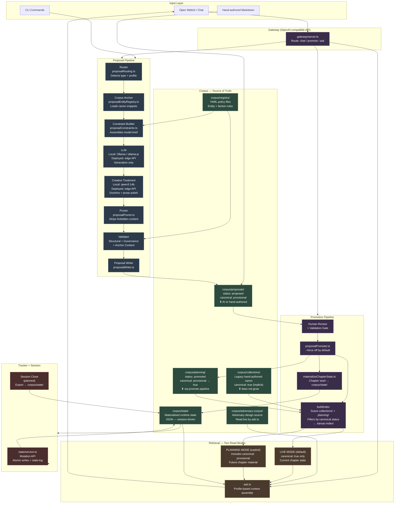
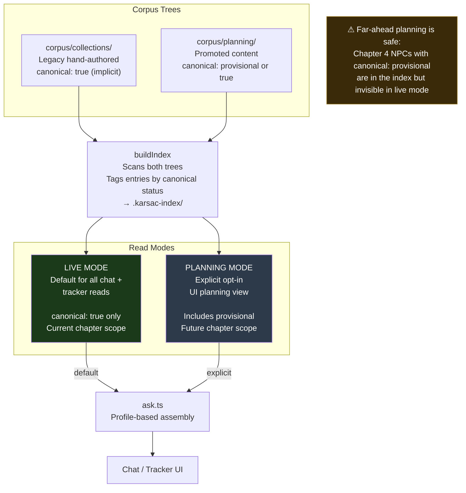
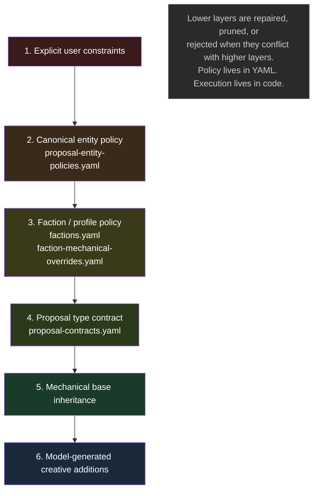

# Architecture Diagram

> **Principle:** Models propose. Code governs.

The diagrams below show the full system as agreed in ADR-0001 (lifecycle) and ADR-0002 (canonical indexing and read modes).

---

## 1. Full System Overview

---

## 2. Lifecycle Flow

```mermaid
flowchart LR
    P["① PROPOSED\ncorpus/proposals/\ncanonical: provisional"]
    R["② REVIEWED\nValidation gate\n+ human approval\n(metadata only)"]
    PR["③ PROMOTED\ncorpus/planning/\ncanonical: provisional"]
    B["canonical: true\n(DM blesses)"]
    M["④ MATERIALISED\ncorpus/state/\nJSON runtime data"]
    T["⑤ TRACKED\nTracker runtime\n+ session mutations"]
    SC["Session Close\n(explicit export)"]

    P -->|"validate\n+ review"| R
    R -->|"promote\n(explicit)"| PR
    PR -->|"bless\n(frontmatter)"| B
    B -->|"materialise\n(chapter outline\nor type hook)"| M
    M -->|"load into\ntracker"| T
    T -->|"session close\n(explicit)"| SC
    SC -->|"export back"| M

    style P fill:#2d3a4a,color:#fff
    style R fill:#2d3a4a,color:#fff
    style PR fill:#2d4a3e,color:#fff
    style B fill:#1a3a2a,color:#fff
    style M fill:#3a2d1a,color:#fff
    style T fill:#3a1a1a,color:#fff
    style SC fill:#3a2a1a,color:#fff
```

---

## 3. Canonical Indexing and Read Modes (ADR-0002)

---

## 4. Governance Precedence

